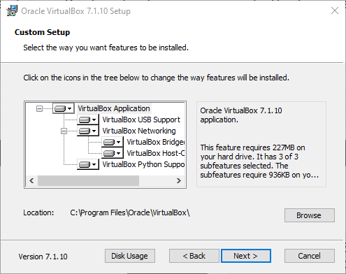

# Informe Técnico

## Índice
- [Informe Técnico](#informe-técnico)
  - [Índice](#índice)
  - [Introducción](#introducción)
  - [Marco Teórico](#marco-teórico)
      - [¿Qué es la virtualización?](#qué-es-la-virtualización)
      - [Beneficios de la virtualización](#beneficios-de-la-virtualización)
      - [Componentes principales de la virtualización](#componentes-principales-de-la-virtualización)
        - [Máquina física](#máquina-física)
        - [Máquina virtual](#máquina-virtual)
      - [Hipervisores](#hipervisores)
      - [Tipos de Hipervisores](#tipos-de-hipervisores)
  - [Caso Práctico](#caso-práctico)
  - [Metodología Utilizada](#metodología-utilizada)
  - [Resultados Obtenidos](#resultados-obtenidos)
  - [Conclusiones](#conclusiones)

## Introducción
La virtualización hoy en día, es una tecnología clave en la informática moderna, ya que nos permite ejecutar múltiples sistemas operativos sobre una única computadora, optimizando recursos y facilitando la posibilidad de tener distintos entornos de prueba, desarrollo y producción.
Este tema es de suma importancia para la carrera, porque hoy en día la gran mayoría de desarrollos y puestas en producción se realiza utilizando máquinas virtuales, Docker, VPS, etc. 
El objetivo principal de este trabajo es aplicar todos los conocimientos adquiridos durante la materia, mediante la creación de un entorno virtual. Se busca demostrar la capacidad de poder configurar un SO dentro de VirtualBox, entender la relación entre esta VM y la máquina HOST, y poder configurarlo correctamente.

## Marco Teórico
#### ¿Qué es la virtualización? 
La virtualización es una tecnología que permite la creación de entornos virtuales a partir de una única máquina física, permitiendo un uso más eficiente de los recursos al distribuirlos entre entornos informáticos.
Mediante software, la virtualización crea una capa de abstracción sobre el hardware informático, dividiendo los componentes de un sistema, como procesadores, memoria, redes y almacenamiento, en múltiples máquinas virtuales (VM). Cada VM ejecuta su propio sistema  operativo y se comporta como un ordenador físico independiente, a pesar de compartir el mismo hardware subyacente.
 

 
_Imagen de ejemplo de virtualización de sistemas_

#### Beneficios de la virtualización
1. Ahorro de costos: Menor necesidad de hardware físico: se pueden ejecutar múltiples sistemas operativos en una sola máquina física.
2. Eficiencia:
Maximiza los recursos disponibles reduciendo el desperdicio y mejorando el rendimiento.
3. Flexibilidad y escalabilidad:
Las máquinas virtuales pueden crearse, duplicarse o eliminarse fácilmente, adaptándose a las necesidades del momento. 
4. Aislamiento y seguridad:
Cada máquina virtual está aislada del sistema operativo anfitrión y de otras VMs. 
Si una VM es atacada o presenta un fallo, no afecta a las demás ni al equipo real.

#### Componentes principales de la virtualización
La virtualización se basa en varios componentes clave para crear y gestionar entornos virtuales. Cada uno de ellos desempeña un papel fundamental para garantizar la asignación eficaz de recursos, de modo que varias máquinas virtuales puedan ejecutarse simultáneamente sin interferencias. Los componentes principales son:
1. Maquina fisica
2. Maquina virtual
3. Hipervisores

##### Máquina física
La máquina física, también denominada “máquina host”, es el hardware que proporciona CPU, memoria, almacenamiento y recursos de red para las máquinas virtuales.

##### Máquina virtual
Una máquina virtual (VM) es un entorno virtual que simula un ordenador físico mediante software. Las VM suelen denominarse "invitadas", con una o más máquinas "invitadas" ejecutándose en un host. 
Según Microsoft:
> "Una máquina virtual es un archivo de software (normalmente llamado imagen) que actúa como una computadora real. Puede ejecutar un sistema operativo completo y comportarse como si fuera una PC independiente."
(Fuente: Microsoft Learn – Virtual Machines)

Las máquinas virtuales tienden de varios archivos, incluyendo la configuración, el almacenamiento del disco duro virtual y otras dependencias.
Sus principales componentes son:
- *CPU virtual*: Procesador simulado, compartido con la CPU física del HOST.
- *Memoria RAM virtual*: Se asigna desde la RAM física del sistema anfitrión.
- *Disco duro virtual*: Archivo que simula un disco (.vdi , .vmdk ).
- *Sistema Operativo*: SO invitado, LINUX, WINDOWS.  

#### Hipervisores
Hipervisores
Los hipervisores son fundamentales en el funcionamiento de las máquinas virtuales. 

Según Red Hat:
> “El hipervisor es el software que crea y ejecuta las máquinas virtuales. Se encarga de asignar los recursos físicos entre las VMs.” (Fuente: Red Hat – Virtualization overview)

Un hipervisor es la capa de software que coordina las máquinas virtuales. Actúa como interfaz entre la máquina virtual y el hardware físico, garantizando que cada una tenga acceso a los recursos físicos necesarios para su ejecución. También garantiza que las máquinas virtuales no interfieran entre sí, vulnerando el espacio de memoria o los ciclos de cómputo de las demás.

Función del hipervisor:
- Actúa como una capa de intermediación entre el hardware físico y las máquinas virtuales.
- Controla qué recursos se asignan a cada VM.
- Asegura el aislamiento entre las VMs para que no interfieran entre sí.

#### Tipos de Hipervisores
Tipos de hipervisores

<ul>
<li>
Hipervisor tipo 1: El hipervisor tipo 1 se ejecuta directamente sobre el hardware físico del sistema anfitrión, sin requerir un sistema operativo intermedio. Administra el acceso al hardware por parte de las VMs de forma directa, lo cual ofrece mejor rendimiento, menor latencia y mayor seguridad.
  
Ventajas:
<ul>
<li>Mayor rendimiento: Al ejecutarse directamente sobre el hardware, no hay capa de sistema operativo que interfiera.</li>
<li>Eficiencia en la gestión de recursos: Accede directamente al hardware, evitando sobrecargas del sistema operativo host.</li>
</ul>
 
Desventajas:
<ul>
<li>Complejidad de instalación: Requiere conocimientos técnicos y configuración específica del hardware.</li>
<li>Requiere hardware dedicado: Está pensado para servidores, no para equipos personales.</li>
</ul>
</li>
 

<li>
Hipervisor tipo 2: Los hipervisores de tipo 2 se ejecutan como una aplicación en un sistema operativo existente. Se utilizan con mayor frecuencia en dispositivos endpoint para ejecutar sistemas operativos alternativos y conllevan una sobrecarga de rendimiento, ya que deben usar el sistema operativo host para acceder y coordinar los recursos de hardware subyacentes.
  
Características técnicas
 
<ul>
<li>Corre sobre sistemas operativos como Windows, macOS o Linux.</li>
<li>Más fácil de instalar y configurar.</li>
<li>Puede tener menor rendimiento debido a la doble capa de abstracción (VM → Hipervisor → Host OS → Hardware).</li>
<li>Adecuado para entornos de desarrollo, pruebas, educación y laboratorios virtuales.</li>
</ul>

 
Ventajas:
<ul>
<li>Fácil de instalar: Se instala como un programa cualquiera (como instalar Chrome o Word).</li>
<li>Permite ejecutar múltiples SO sin afectar el host: Se puede tener Windows, Linux y otros corriendo dentro de tu PC.</li>
</ul>
 
Desventajas:
<ul>
<li>Menor rendimiento: La VM depende del sistema operativo host para acceder al hardware.</li>
<li>Menor aislamiento: Si el host tiene un problema, afecta a todas las VMs.</li>
<li>Menor escalabilidad: No está optimizado para muchas VMs concurrentes</li>
</ul>
</li>
</ul>

## Caso Práctico
Ingresamos al [sitio web](<https://www.virtualbox.org/wiki/Downloads>) y presionamos ‘Windows hosts’
 

 

Se nos abre la pantalla de instalación
 

 

Aceptamos los términos y condiciones
 

 

Nos permite elegir las características con las que viene VBox, le damos a Next
 

 

Nos avisa que el programa de instalación va a instalar los drivers de internet, por lo que puede dejarnos momentáneamente sin conexión
 

 

Nos informa que nos falta unas dependencias, le damos a Yes para instalarlas
 

 

Nos pregunta qué accesos directos queremos
 

 

Presionamos INSTALL y comienza el proceso de instalación
 

 

Una vez terminado, podemos presionar Finish y se nos abrirá el programa
 

 

Descargamos la distro de Ubuntu, desde el [sitio web oficial](https://ubuntu.com/download/desktop)
 

 

 

Una vez descargada, abrimos el programa y presionamos '**Nueva**'
 

 

Indicamos los datos necesarios:
• Nombre
• Carpeta
• Imagen ISO (descargada previamente)
• Tipo
• Subtipo
• Versión
 

 

Dentro de la sección de 'Instalación desatendida', ingresamos nombre de usuario y contraseña, para que VBox instale Ubuntu de forma automática
 

 

Indicamos RAM y Procesadores a utilizar
La página oficial de Ubuntu, recomienda 4 GB mínimos.
 

 

Indicamos el espacio máximo del disco duro, y si queremos reservarlo ahora o almacenar dinámicamente
 

 

Presionamos '**Terminar**' y se nos abrirá la VM
 

 

VirtualBox inicia la instalación de Ubuntu de forma automática
 

 

Una vez terminado, se reiniciará la máquina virtual y nos permitirá iniciar sesión
 

 

Iniciamos sesión, y ya tenemos nuestra VM con Ubuntu lista para usar
 

 

Abrimos la terminal
 

 

 

Verificamos si Python está instalado, en este caso lo está
 

 

Si Python no está instalado, podemos utilizar *sudo apt install python3* para instalarlo
 

 

Creamos un nuevo archivo utilizando *nano ./promedios.py*
 

 

Guardamos el archivo presionando la combinación 'CTRL + X'
 

 
Presionamos 'Y' y luego ENTER, y el archivo estará creado
 

 

Damos permisos de ejecución utilizando *chmod +x ./promedios.py*
 

 

Y ejecutamos el mismo utilizando *python3 ./promedios.py*
 

 

## Metodología Utilizada
Nos dividimos la investigación teórica, y el caso práctico por separado. Nos pusimos de acuerdo en que lo mostrado estaba OK guardando la información en un documento de google, y procedimos a la creación del repositorio.

## Resultados Obtenidos
- Obtuvimos VirtualBox
- Obtuvimos una máquina virtual configurada, y lista para su uso
- Descargamos e instalamos python
- Aprendimos que python no es lo mismo que python3 dentro de Linux

## Conclusiones
- Aprendimos a configurar una máquina virtual utilizando VirtualBox
- Aprendimos sobre hardware y especificaciones mínimas, dandole los recursos apropiados a la máquina virtual para ejecutarse correctamente
- Nos familiarizamos con Linux y su terminal, utilizando comandos como ls, nano y chmod para poder crear un nuevo script en Python directo desde ella
- Hicimos uso de ‘apt’, uno de los gestores de paquete más utilizados
- Creamos un script en Python dentro de la máquina virtual, aprendiendo sobre entornos aislados