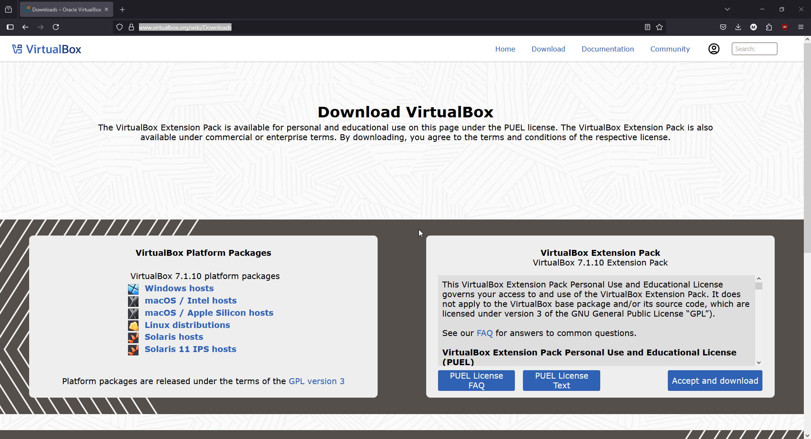
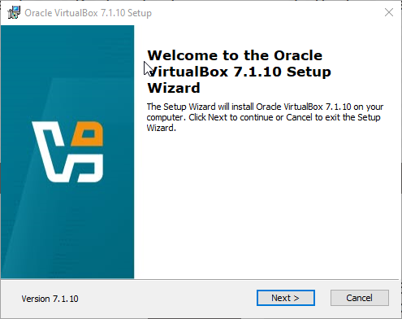

# Informe Técnico

## Índice

[Introducción](#introduccion)
[Marco Teórico](#marcoteorico)
[Caso Práctico](#casopractico)
[Metodología Utilizada](#metodologia_utilizada)
[Resultados Obtenidos](#resultados_obtenidos)
[Conclusiones](#conclusiones)

## Introducción
La virtualización hoy en día, es una tecnología clave en la informática moderna, ya que nos permite ejecutar múltiples sistemas operativos sobre una única computadora, optimizando recursos y facilitando la posibilidad de tener distintos entornos de prueba, desarrollo y producción.
Este tema es de suma importancia para la carrera, porque hoy en día la gran mayoría de desarrollos y puestas en producción se realiza utilizando máquinas virtuales, Docker, VPS, etc. 
El objetivo principal de este trabajo es aplicar todos los conocimientos adquiridos durante la materia, mediante la creación de un entorno virtual. Se busca demostrar la capacidad de poder configurar un SO dentro de VirtualBox, entender la relación entre esta VM y la máquina HOST, y poder configurarlo correctamente.

## Marco Teórico
> pendiente

## Caso Práctico
Ingresamos al [sitio web](<https://www.virtualbox.org/wiki/Downloads>) y presionamos ‘Windows hosts’
 

 

Se nos abre la pantalla de instalación
 

 

Aceptamos los términos y condiciones
 

 

Nos permite elegir las características con las que viene VBox, le damos a Next
 

 

Nos avisa que el programa de instalación va a instalar los drivers de internet, por lo que puede dejarnos momentáneamente sin conexión
 

 

Nos informa que nos falta unas dependencias, le damos a Yes para instalarlas
 

 

Nos pregunta qué accesos directos queremos
 

 

Presionamos INSTALL y comienza el proceso de instalación
 

 

Una vez terminado, podemos presionar Finish y se nos abrirá el programa
 

 

Descargamos la distro de Ubuntu, desde el [sitio web oficial](https://ubuntu.com/download/desktop)
 

 

 

Una vez descargada, abrimos el programa y presionamos '**Nueva**'
 

 

Indicamos los datos necesarios:
• Nombre
• Carpeta
• Imagen ISO (descargada previamente)
• Tipo
• Subtipo
• Versión
 

 

Dentro de la sección de 'Instalación desatendida', ingresamos nombre de usuario y contraseña, para que VBox instale Ubuntu de forma automática
 

 

Indicamos RAM y Procesadores a utilizar
La página oficial de Ubuntu, recomienda 4 GB mínimos.
 

 

Indicamos el espacio máximo del disco duro, y si queremos reservarlo ahora o almacenar dinámicamente
 

 

Presionamos '**Terminar**' y se nos abrirá la VM
 

 

VirtualBox inicia la instalación de Ubuntu de forma automática
 

 

Una vez terminado, se reiniciará la máquina virtual y nos permitirá iniciar sesión
 

 

Iniciamos sesión, y ya tenemos nuestra VM con Ubuntu lista para usar
 

 

Abrimos la terminal
 

 

 

Verificamos si Python está instalado, en este caso lo está
 

 

Si Python no está instalado, podemos utilizar *sudo apt install python3* para instalarlo
 

 

Creamos un nuevo archivo utilizando *nano ./promedios.py*
 

 

Guardamos el archivo presionando la combinación 'CTRL + X'
 

 
Presionamos 'Y' y luego ENTER, y el archivo estará creado
 

 

Damos permisos de ejecución utilizando *chmod +x ./promedios.py*
 

 

Y ejecutamos el mismo utilizando *python3 ./promedios.py*
 

 

## Metodología Utilizada
Nos dividimos la investigación teórica, y el caso práctico por separado. Nos pusimos de acuerdo en que lo mostrado estaba OK guardando la información en un documento de google, y procedimos a la creación del repositorio.

## Resultados Obtenidos
- Obtuvimos VirtualBox
- Obtuvimos una máquina virtual configurada, y lista para su uso
- Descargamos e instalamos python
- Aprendimos que python no es lo mismo que python3 dentro de Linux

## Conclusiones
- Aprendimos a configurar una máquina virtual utilizando VirtualBox
- Aprendimos sobre hardware y especificaciones mínimas, dandole los recursos apropiados a la máquina virtual para ejecutarse correctamente
- Nos familiarizamos con Linux y su terminal, utilizando comandos como ls, nano y chmod para poder crear un nuevo script en Python directo desde ella
- Hicimos uso de ‘apt’, uno de los gestores de paquete más utilizados
- Creamos un script en Python dentro de la máquina virtual, aprendiendo sobre entornos aislados